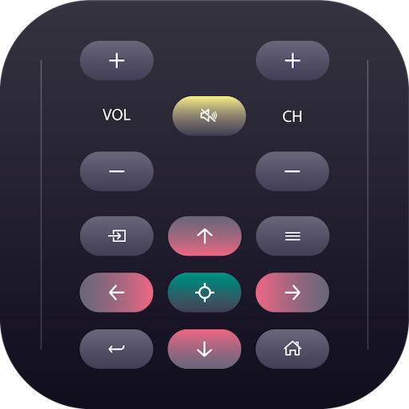

[](https://opensource.org/licenses/MIT)
<a href="https://www.buymeacoffee.com/denikucevic"></a>

* Google Play Store: https://play.google.com/store/apps/details?id=io.ionic.sonyremote
* App Gallery: https://appgallery.huawei.com/app/C108045737

# Sony Remote Control

<p align="center">
  
</p>

A Capacitor app for controlling Sony BRAVIA TVs over your local network — no ads, no accounts, no nonsense.

## Description

App works on Android and iOS. TV discovery uses mDNS/Bonjour — your TV announces itself on the network, no IP entry or subnet scanning required. Once discovered, you pair once with the PIN shown on your TV and you're good to go.

There is no web support since browsers can't do mDNS discovery and asking users to type an IP address felt too technical. I might revisit this later.

Built with Capacitor 8, React 18, and Ionic 6. This started as a passion project because every Sony remote app I found was riddled with ads. I can guarantee there will never be any ads here 😎. Code is free and open source — if you want to contribute, open a PR and I'll update the app stores and add you to contributors. Suggestions and ideas are welcome 😊.

## Getting Started

### Requirements

* Node.js v18+
* npm v9+
* JDK 21 (required by Capacitor 8 — set in Android Studio under **File → Settings → Build Tools → Gradle → Gradle JDK**)
* Android Studio (for Android builds)
* Xcode (for iOS builds)

### Install

```
npm install
```

### Run in browser (no TV discovery)

```
npm run start
```

### Run on device

Sync web assets to the native project:

```
npx ionic capacitor sync android
# or
npx ionic capacitor sync ios
```

Then open in Android Studio or Xcode and run on a connected device. The Ionic extension for VS Code also works well for this.

## How it works

1. Open the app and go to **Scan for TVs** — the app sends an mDNS query for `_androidtvremote2._tcp.local.` and your TV responds automatically
2. Tap your TV in the list to start pairing
3. A PIN appears on your TV screen — enter it in the app
4. Done — you can now control your TV

## Tech Stack

* [Capacitor 8](https://capacitorjs.com/) — native runtime
* [React 18](https://react.dev/) + [Ionic 6](https://ionicframework.com/) — UI
* [capacitor-zeroconf](https://github.com/trik/capacitor-zeroconf) — mDNS discovery via JmDNS
* [Sony BRAVIA Professional Display API](https://pro-bravia.sony.net/develop/) — TV control

## Authors

[@DeniKucevic](https://github.com/DeniKucevic)

## Version History

* 1.1.0
    * Upgraded to Capacitor 8
    * Replaced subnet scanning with mDNS/Bonjour discovery
    * Improved scan reliability and UI responsiveness
* 0.1
    * Initial Release

## License

This project is licensed under the MIT License — see the LICENSE.md file for details

## Acknowledgments

* [pro-bravia.sony](https://pro-bravia.sony.net/develop/)
* [trik/capacitor-zeroconf](https://github.com/trik/capacitor-zeroconf)
